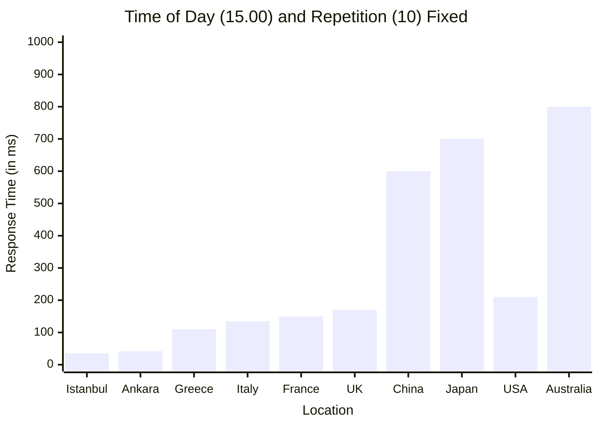
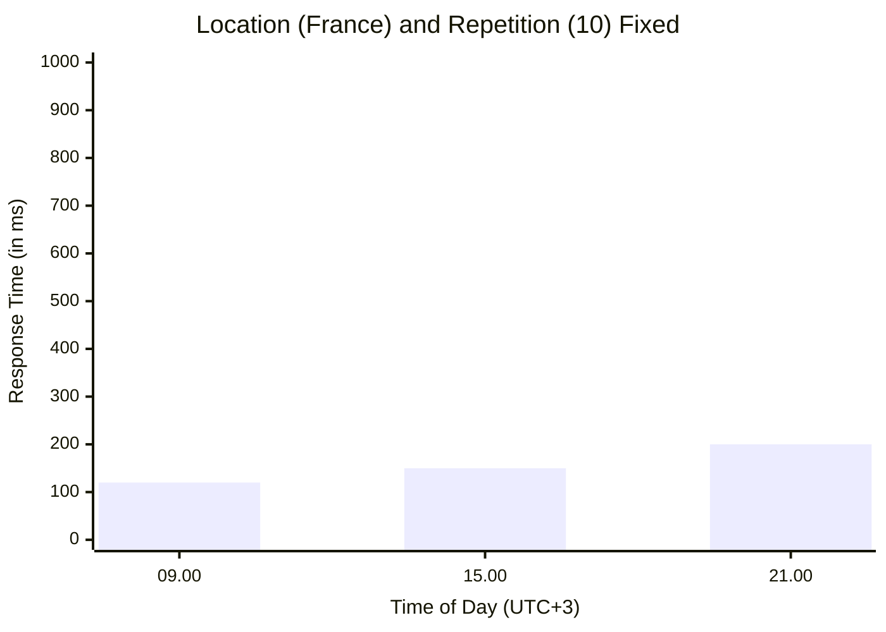
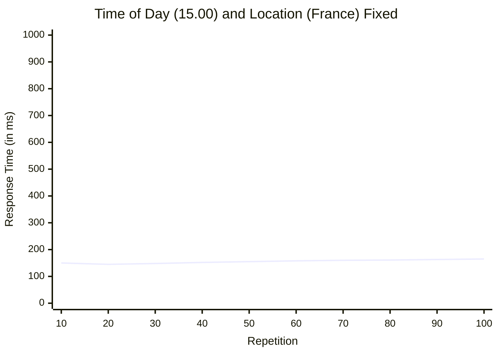

# HW1 Report
## Introduction
In this study, I measured the network latency to various locations (Istanbul, Ankara, Greece, Italy, France, UK, China, Japan, USA, Australia) for four days (Tuesday, Friday, Saturday and Sunday) at three different times (09:00, 15:00, 21:00), repetatively.

The goal was to see how the network latency changes over time and day. And also, to see if there is a pattern in the network latency.

## Methodology
For more accurate results, `sudo dscacheutil -flushcache; sudo killall -HUP mDNSResponder` command was executed before each measurement to avoid any caching issues in MacOS.

The requests are sent to the homepages of the universities in the determined locations. The response time is measured in milliseconds.

## Results
Charts below is showing the response time against the three parameters by fixing two of them each time.

## Analysis

### Locations
- Local locations (Istanbul and Ankara) have the lowest response time.
- European locations (Greece, Italy, France, UK) have a moderate response time.
- Asian locations (China, Japan) have a high response time.
- Interestingly, the USA has a lower response time considering the distance.

### Times
- 09:00: Response times are generally lower, likely due to lower internet traffic in the morning.
- 15:00: Response times increase, possibly reflecting higher internet usage during work and school hours.
- 21:00: The highest response times are observed, likely due to peak internet usage in the evening for activities like streaming or gaming.

### Days
- Weekdays have a lower response time compared to weekends. This is expected since there is less traffic on weekdays.

### Request Count
- As the number of requests increases, response times show a slight rise. Initially stable with 10 requests, latency gradually increases from 150 ms to 165 ms as repetitions reach 100, likely due to network congestion.

## Conclusion
The study shows that network latency is affected by both distance and the time of day. Local destinations tend to have lower latency, while global destinations (especially those in Asia-Pacific) have significantly higher response times. Evening hours see higher latency due to peak internet usage.
